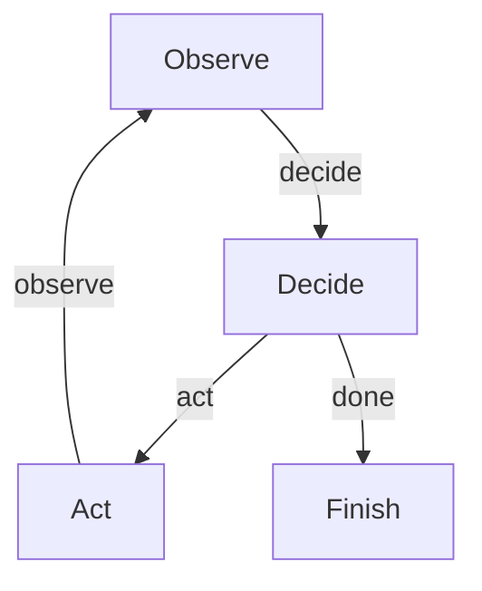

# Browser-Use Agent

This project demonstrates a minimal **browser-use agent** built on PocketFlow: give it a goal in plain English and it drives a real Chrome browser to accomplish it — clicking buttons, filling forms, and reading the page — all in one small `Observe -> Decide -> Act` loop.

It ships with **two modes** for how the agent *sees* the page, the same split that divides the whole industry:

- **`dom`** (default) — reads the page's structured elements as text and clicks by element number. Cheap, precise, fast. This is how `browser-use` and Playwright MCP work.
- **`pixels`** — takes a screenshot and clicks by x/y coordinates, like OpenAI Operator / Claude computer use / Gemini. Universal (works on anything a human can see), but the model has to *guess* where to click — the grounding problem — so it's slower and pricier.

The loop is identical in both modes; only the `Observe` and `Act` nodes change.

> **DOM vs. pixels, in practice.** The DOM agent is cheap, precise, and fast, but it's blind to anything not in the DOM (a game on a `<canvas>`, a native desktop app, a PDF rendered in the page). The pixel agent works on *anything a human can see*, but it has to guess coordinates, so it's slower, pricier, and can misclick — the **grounding problem**. One concrete example: a native HTML `<select>` dropdown is genuinely hard for a pixel agent, because its option list pops up in an OS-level overlay that a page screenshot can't even capture, so the model can't see the options to click them. That's exactly why the demo page below uses clickable **size buttons** instead of a `<select>` — so the pixel agent gets a fair shot. Swap them for a real `<select>` and watch the pixel agent struggle while the DOM agent (`select_option`) handles it trivially.

## Features

- Two seeing strategies — DOM text vs. raw screenshots — from the same loop
- Makes one LLM call per step to decide the single next action
- Clicks, types, selects, and presses keys on a real browser via Playwright
- Loops until the goal is met, with a safety cap so it can never run forever
- Ships with a tiny local "Pocket Cafe" page so it runs the same way every time

## Getting Started

1. Install the packages you need with this simple command:
```bash
pip install -r requirements.txt
```

2. Install the browser that Playwright drives (one-time):
```bash
python -m playwright install chromium
```

3. Let's get your OpenAI API key ready (any model with vision, e.g. `gpt-4o`, works for both modes):
```bash
export OPENAI_API_KEY="your-api-key-here"
```

4. Do a quick check to make sure your API key is working properly:
```bash
python utils.py
```
If you see a response, you're good to go!

5. Watch the DOM agent order a coffee on the bundled demo page:
```bash
python main.py
```
A browser window pops open and the agent accepts the cookie banner, picks the latte, sets the size, types the name, and places the order.

6. Try the pixel (vision) agent on the same task and compare:
```bash
python main.py --mode=pixels
```

7. Point it at any goal (or any site) with the `--goal=` and `--url=` options:
```bash
python main.py --goal="Order a small Mocha for Alex and report the confirmation"
python main.py --url="https://example.com" --goal="Report the first heading on the page"
```
Add `--headless` to run without opening a visible window.

## How It Works?

The magic happens through a simple but powerful graph structure — three nodes in a loop:



Here's what each part does:
1. **Observe**: reads the current page — in `dom` mode as a numbered list of elements (`[0] <button> "Latte"`), in `pixels` mode as a screenshot
2. **Decide**: sends that observation plus the goal and history to the LLM, which replies with exactly one action in a small YAML block — `click 5` (dom) or `click x=210 y=480` (pixels)
3. **Act**: performs that one action on the real page with Playwright, then loops back to Observe to see what changed

The key idea is that the model never touches the browser directly — it only ever emits text, and the `Act` node is what actually calls `.click()`. The "agent" is the loop; the model is one step inside it. The only thing that changes between the two modes is *what the model looks at* and *how it names the click*.

## Files

- [`main.py`](./main.py): entry point — launches the browser, picks the mode, runs the flow
- [`flow.py`](./flow.py): wires the Observe -> Decide -> Act loop (`create_dom_agent_flow` / `create_vision_agent_flow`)
- [`nodes_dom.py`](./nodes_dom.py): DOM mode — reads elements as text, clicks by element number
- [`nodes_vision.py`](./nodes_vision.py): pixel mode — reads a screenshot, clicks by x/y coordinates
- [`utils.py`](./utils.py): the LLM call (text or vision) and the YAML parser
- [`demo_site/index.html`](./demo_site/index.html): a tiny local order form to drive
